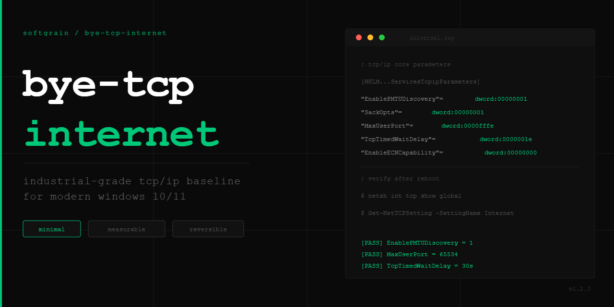

# bye-tcp-internet



**Industrial-grade TCP/IP baseline profile for modern Windows 10/11 networking stacks.**

No legacy tweaks. No placebo. No deprecated parameters.

---

## Philosophy: Minimal • Measurable • Reversible

- **Minimal** — only keys read by `tcpip.sys` on current builds. No XP/Vista/7-era garbage.
- **Measurable** — every change is verifiable via `netsh` and `Get-NetTCPSetting`. Effect is technical, not subjective.
- **Reversible** — `apply.bat` records a snapshot of your exact previous values before every apply; `snapshot.ps1 -Restore` puts each one back (original data, or deleted if it did not exist). Static `*-rollback.reg` files remain as a no-script fallback. No files are modified.

---

## Profiles

Choose **one** profile depending on your use case.

### `universal.reg` — Baseline

Universal profile for workstations and servers. Removes artificial system limits.

| Key | Value | Effect |
|-----|-------|--------|
| `DefaultTTL` | 64 | Standard modern TTL (matches Linux/BSD defaults) |
| `EnablePMTUDiscovery` | 1 | Avoids IP fragmentation on modern links |
| `EnablePMTUBHDetect` | 0 | Disables slow black hole detection |
| `SackOpts` | 1 | Selective ACK — efficient loss recovery |
| `Tcp1323Opts` | 1 | Window Scaling only ¹ |
| `MaxUserPort` | 65534 | Expanded ephemeral port range |
| `TcpTimedWaitDelay` | 30 | TIME_WAIT reduced: 240s → 30s |
| `EnableECNCapability` | 0 | ECN disabled — ISP compatibility ² |
| `NetworkThrottlingIndex` | 0xFFFFFFFF | Removes multimedia packet throttle |
| `SystemResponsiveness` | 20 | 20% reserved for background tasks |
| `NonBestEffortLimit` | 0 | Removes QoS bandwidth reservation |
| `NegativeCacheTime` | 60s | Balanced DNS negative cache |
| `NetFailureCacheTime` | 30s | Retry failed DNS lookups sooner |

> ¹ **`Tcp1323Opts` explained:** Value `1` enables Window Scaling only. Value `3` also enables TCP Timestamps, adding 12 bytes overhead per segment. For most modern networks, Window Scaling alone is sufficient. On high-BDP links (satellite, intercontinental) consider value `3`.

> ² **ECN note:** Theoretically beneficial but widely mishandled by ISP equipment and home routers, causing connection failures or latency spikes. Disabled for compatibility.

### `gmvelocity.reg` — Low-Latency Gaming

Full superset of `universal.reg`. All baseline keys plus gaming-specific additions:

| Key | Value | Effect |
|-----|-------|--------|
| `SystemResponsiveness` | 0 | All CPU time available to foreground |
| `Tasks\Games GPU Priority` | 8 | Higher GPU scheduling priority |
| `Tasks\Games Priority` | 6 | Higher MMCSS task priority |
| `Tasks\Games Scheduling Category` | High | Kernel scheduler category |
| `Tasks\Games SFIO Priority` | High | Storage I/O priority for game tasks |
| `NegativeCacheTime` | 0 | Zero DNS negative cache (instant retry) |
| `NetFailureCacheTime` | 0 | Zero DNS failure cache |
| `MaxNegativeCacheTtl` | 0 | Override TTL for negative DNS responses |

---

## What is NOT changed

Intentionally left untouched to preserve stack stability:

- **Autotuning** — not disabled. Dynamic window management in Windows 11 is effective by default.
- **Congestion Control** — CUBIC remains the default provider.
- **TCPNoDelay** — not set globally. Belongs at the application level.
- **Legacy Keys** — no `TcpWindowSize` or other Vista-era parameters.

---

## Before / After

After applying and rebooting, run `netsh int tcp show global`. Key lines to check:

```
ECN Capability                      : disabled       ✓ set by profile
RFC 1323 Timestamps                 : disabled       ✓ Tcp1323Opts=1 (WS only, TS off)
Receive Window Auto-Tuning Level    : normal         — NOT touched (AutoTuning preserved)
Add-On Congestion Control Provider  : cubic          — NOT touched
```

PowerShell:

```powershell
Get-NetTCPSetting -SettingName Internet
```

Or use the included `verify.ps1` for a full automated check with PASS/FAIL output, a summary line and an exit code (`0` = no FAIL, `1` = at least one FAIL). It also compares registry values with the **live** stack (ECN, timestamps, dynamic port range) and prints `[WARN]` when they differ.

---

## Usage

### 1. Apply

Option A — interactive (recommended, takes a snapshot automatically):
```
apply.bat   (run as Administrator)
```

Option B — manual:
1. Take a snapshot first (Administrator PowerShell): `powershell -ExecutionPolicy Bypass -File snapshot.ps1 -Backup`
2. Double-click the chosen `.reg` file → Run as Administrator
3. **Reboot**

### 2. Verify

```powershell
# Quick check
netsh int tcp show global

# Full automated verification
powershell -ExecutionPolicy Bypass -File verify.ps1
```

### 3. Rollback

**Exact restore (recommended)** — `apply.bat` → `[6]`, or:

```powershell
powershell -ExecutionPolicy Bypass -File snapshot.ps1 -Restore -WhatIf   # preview
powershell -ExecutionPolicy Bypass -File snapshot.ps1 -Restore           # apply
powershell -ExecutionPolicy Bypass -File snapshot.ps1 -List              # list snapshots
```

Restores the state from before the **first** apply (`baseline.json`, stored in `%ProgramData%\bye-tcp-internet\snapshots`, Administrators/SYSTEM only). Only the values this project writes can be touched. Reboot afterwards.

**Static fallback** — run the corresponding `rollback.reg` and reboot. These files do not know your previous values: they delete the keys, except `NetworkThrottlingIndex` and `SystemResponsiveness`, which are set to `10` and `20`; `Tasks\Games` values are deleted, not reset.

| Applied | Rollback |
|---------|----------|
| `universal.reg` | `universal-rollback.reg` |
| `gmvelocity.reg` | `gmvelocity-rollback.reg` |

---

## Compatibility

| OS | Status |
|----|--------|
| Windows 10 22H2+ | ✅ Supported |
| Windows 11 (all builds) | ✅ Supported |
| Windows Server 2022/2025 | ✅ Supported |
| Windows 10 < 22H2 | ⚠️ Not tested |
| Windows 7 / 8 / 8.1 | ❌ Not supported |

---

## Files

```
bye-tcp-internet/
├── universal.reg              # Baseline profile
├── universal-rollback.reg     # Rollback for universal
├── gmvelocity.reg             # Low-latency gaming profile
├── gmvelocity-rollback.reg    # Rollback for gmvelocity
├── apply.bat                  # Interactive installer (snapshots before apply)
├── snapshot.ps1               # Exact-state backup / restore
├── verify.ps1                 # Post-apply verification (registry + live stack)
├── .gitattributes             # Keeps CRLF in .reg/.bat/.ps1
├── CHANGELOG.md               # Version history
└── LICENSE
```

---

## Methodology & Safety

- Changes remove only client-side limits. Physical latency (RTT) is not affected by registry tweaks.
- Registry Overrides only — no binary patching, no driver replacement.
- Based on `tcpip.sys` behavior analysis (2025–2026 builds).

---
---

## RU — Русская документация

### Что это

**bye-tcp-internet** — верифицированный набор настроек реестра для сетевого стека `tcpip.sys`. Цель — убрать искусственные ограничения Windows без устаревших и «плацебо» методов.

### Профили

**`universal.reg`** — универсальный baseline для рабочих станций и серверов. Расширяет диапазон портов, ускоряет освобождение TIME_WAIT, активирует PMTU и SACK, отключает сетевой дроссель и резервирование QoS.

**`gmvelocity.reg`** — игровой профиль с низкой задержкой. Включает всё из universal плюс: повышение приоритета MMCSS для игр, агрессивный DNS (нулевой кэш отказов), нулевой SystemResponsiveness.

### Установка

1. Запустить `apply.bat` от имени администратора — перед применением он автоматически сохраняет снимок текущих значений
   *(вручную: сначала `snapshot.ps1 -Backup`, затем нужный `.reg` от имени администратора)*
2. **Перезагрузить систему**

### Проверка

```powershell
# Быстрая
netsh int tcp show global

# Полная автоматическая (итог PASS/FAIL/WARN, код возврата 0/1)
powershell -ExecutionPolicy Bypass -File verify.ps1
```

`verify.ps1` сверяет реестр и с *живым* состоянием стека (ECN, timestamps, диапазон динамических портов); расхождение выводится как `[WARN]`.

### Откат

**Точный откат (рекомендуется):** `apply.bat` → `[6]` или `snapshot.ps1 -Restore` (предпросмотр: `-WhatIf`). Возвращает значения, которые были до первого применения: исходные данные или удаление, если значения не было. Перезагрузить ПК.

**Запасной вариант:** `rollback.reg` → перезагрузить ПК. Файл не знает прежних значений: ключи удаляются, кроме `NetworkThrottlingIndex` и `SystemResponsiveness` (ставятся `10` и `20`); значения `Tasks\Games` удаляются, а не сбрасываются.

### Заметки по ключам

**`Tcp1323Opts=1`** — включает только Window Scaling. Значение `3` дополнительно активирует TCP Timestamps (+12 байт на сегмент). Для большинства сетей достаточно `1`. На высоко-BDP каналах (спутник, межконтинентальные линки) можно поставить `3`.

**`EnableECNCapability=0`** — ECN отключён из-за плохой поддержки на оборудовании ISP и домашних роутерах. Включение может вызвать обрывы соединений.

### Что НЕ меняется

- AutoTuning — не отключается
- Congestion Control (CUBIC) — не меняется  
- TCPNoDelay — не навязывается глобально
- Легаси-ключи эпохи XP/Vista — отсутствуют

---

## Author

**softgrain** — [GitHub](https://github.com/grainframe)

## License

MIT
